## 实现简易GoogleTest测试框架笔记
### 1. c++源代码到可执行文件的过程
- 预处理：生成 .i 的文件, #include的展开，宏定义的替换
- 编译：将预处理后的文件转换成汇编语言, 生成文件 .s, 进行语法检查
- 汇编: 有汇编变为目标代码(机器代码)生成 .o 的文件[汇编器as]
- 链接: 连接目标代码, 生成可执行程序，将不同文件中对象的定义链接起来。

```
g++ -c test.cc // 只激活预处理,编译,和汇编, 生成test.o
```

查看test.o 文件
```
nm -C test.o
```

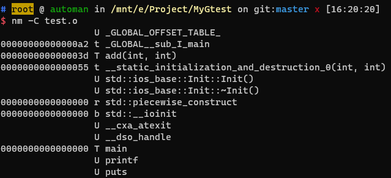

前边有数字的，表示这个对应的函数是在test.o文件中定义的如main, add，否则不是例如printf。

如果删除相应函数的定义
```c++
int add (int a, int b);

int main() {
    printf("hello world\n");
    printf("add(3, 4) = %d\n", add(3, 4));
    return 0;
}
```
然后执行
```
g++ test.cc
```
会有未定义的报错

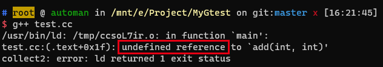

但是可以通过编译阶段
```
g++ -c test.cc
```
会生成test.o,并进行查看

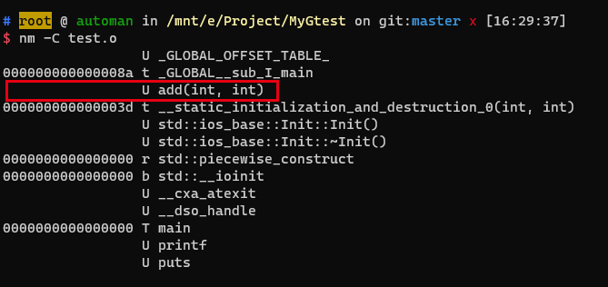

说明add函数不在test.cc文件中定义。因此编译阶段只是进行语法的检查，有函数的声明，那么语法检查就会通过，只是链接阶段，会有未定义的错误。

在add.cc中，添加add函数的定义，再重新编译，链接就可以通过。

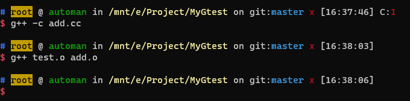

还有一种是重定义的错误，add.cc和test.cc中都包含add函数定义时，会报错误

### 2. 函数定义与声明
定义：包括函数的具体实现
声明：告诉系统有这样的一个函数，一般是在头文件中包含。
```c++
// add函数的声明 
int add (int a, int b);

int main() {
    printf("hello world\n");
    printf("add(3, 4) = %d\n", add(3, 4));
    return 0;
}

// add函数的定义
int add (int a, int b) {
    return a + b;
};
```
### 3. C++ 四种编程方式
```c++
// 面向过程编程
int add1 (int a, int b) {
    return a + b;
};

// 面向对象编程
class ADD {
    public:
        int operator()(int a, int b) {
            return a + b;
        }
};

// 泛型编程
template <typename T, typename U>
// 位置返回允许我们在参数列表之后返回类型
auto add3(T a, U b) -> decltype(a + b) {
    return a + b;
};

// 函数编程 lamda表达式
auto add4 = [](int a, int b) -> int {
    return a + b;
};
```

### 4. 使用GoogleTest框架
下载GoogleTest
```
git clone https://github.com/google/googletest
```

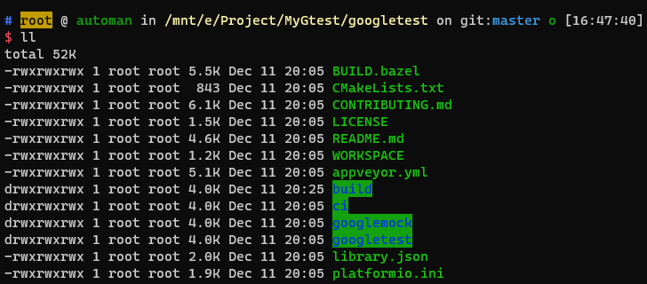

下载下来，进入googletest创建build文件，并在此文件下进行cmake命令
```
mkdir build

cd build 

cmake ../
```
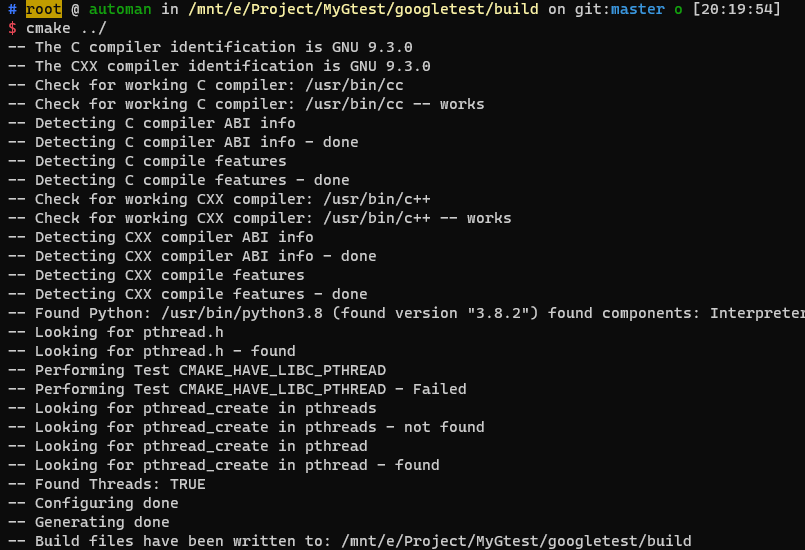

然后注意生成的Makefile文件，再执行make命令
```
make
```
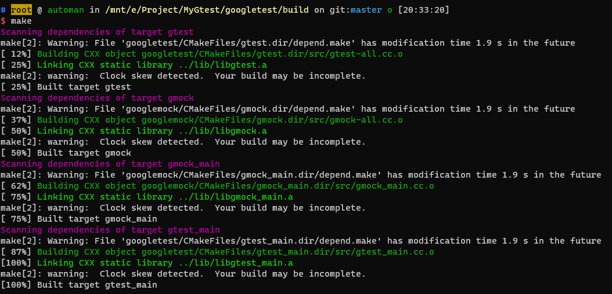

注意lib文件下的.a文件，这是静态链接库。将lib文件复制到MyGtest文件，包括了函数的定义，在将googletest文件下的include文件同样复制到，那就有了这些函数的声明。

编写好googletest代码文件后，直接运行会报错
```c++
#include "gtest/gtest.h"

using namespace std;

int add (int a, int b) {
    return a + b;
};

TEST(test, add1) {
    EXPECT_EQ(add(3, 4), 7); // ==
    EXPECT_NE(add(3, 4), 9); // !=
    EXPECT_LT(add(3, 4), 8); // <
    EXPECT_LE(add(3, 4), 7); // <=
    EXPECT_GT(add(3, 4), 6); // >
    EXPECT_GE(add(3, 4), 7); // >=
}

TEST(test, add2) {
    EXPECT_EQ(add(3, 4), 7); // ==
    EXPECT_NE(add(3, 4), 9); // !=
    EXPECT_LT(add(3, 4), 8); // <
    EXPECT_LE(add(3, 4), 7); // <=
    EXPECT_GT(add(3, 4), 9); // error >
    EXPECT_GE(add(3, 4), 7); // >=
}

int main() {
    printf("hello world\n");
    printf("add(3, 4) = %d\n", add(3, 4));
    return RUN_ALL_TESTS();
}
```

```
g++ test.cc
```
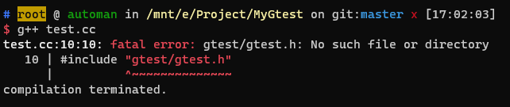
需要添加头文件的搜索路径
```
g++ -I./include test.cc
```
但是有未定义的报错

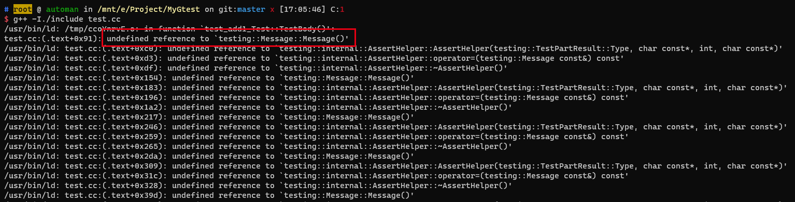

需要添加链接库,注意还有线程库，不然会报错
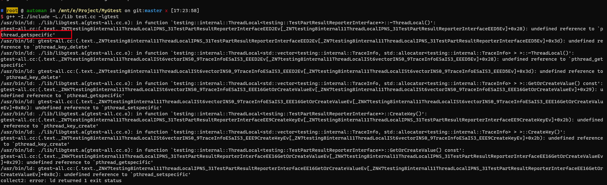

```
g++ -I./include -L./lib test.cc -lgtest -lpthread
```
然后执行查看谷歌测试

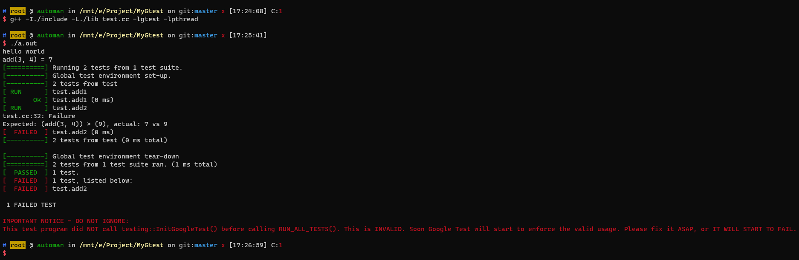

### 5. printf 输出彩色文字
语法：
```
\033[ A1;A2;A3;…An m
```
这里的An详情请看应用规范中的表格

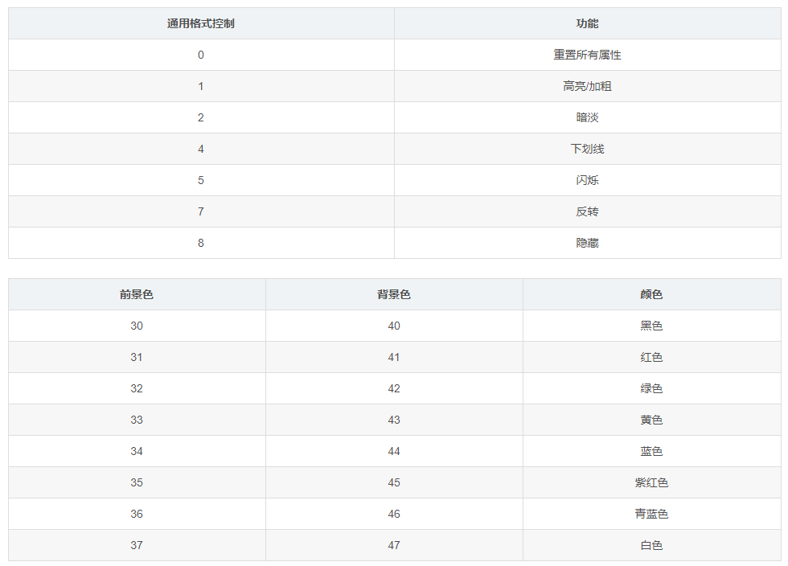

示例
```c++
printf("\033[1;33;41mhello world\n");
```
输出：

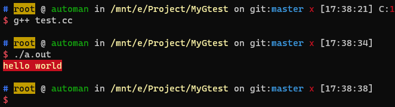

但是多行输出时
```c++
printf("\033[1;33;41mhello world\n");
printf("hello world\n");
```
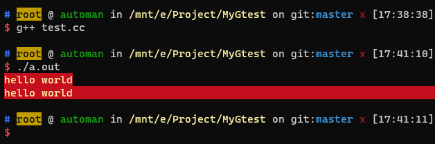
这里我们只想让第一行有颜色效果而第二行只想普通的输出，
但是当我们输出之后却发现第二行也同样有颜色。

这就是说颜色输出并不是以行为单位的。

这实际上是一个shell脚本。

所以要使用**0**这个属性
```c++
printf("\033[0;33;41mhello world\033[0m\n");
printf("I like coding\n");
```

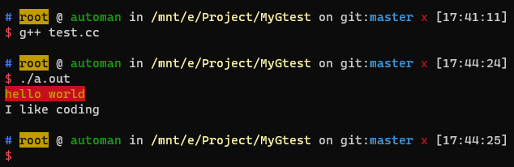

这样在输出前先重置一次防止前面的影响后面的打印，在输出的最后加一次重置，防止影响后面的打印。

### 6. 预处理命令-宏定义
宏做的事情就是简单的**替换**

c++ 常用内置宏定义

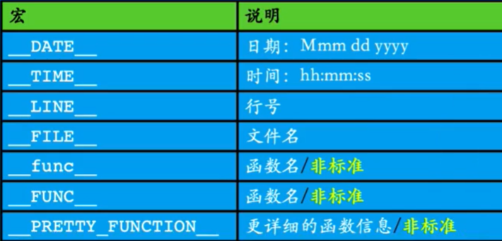

```c++
#define PI 3.1415926
#define S(a,b) a * b

int main() {
    printf("%lf\n", PI * 2);
    printf("S(3, 4) = %d\n", S(3, 4));
    printf("S(5 + 6, 4) = %d\n", S(5 + 6, 4));
    int n;
    S(int , p) = &n;
    printf("__LINE__ = %d\n", __LINE__);
    printf("__FILE__ = %s\n", __FILE__);
    printf("__func__ = %s\n", __func__);
    printf("__PRETTY_FUNCTION__ = %s\n", __PRETTY_FUNCTION__);
    return 0;
}
```
查看预处理之后的源码
```
g++ -E define.cc > output.cc
vim output.cc
```
注意下列代码
```c++
#define S(a,b) a * b
int n;
S(int , p) = &n;
```
在预处理之后变为，没有任何问题。
```c++
int n;
int * p = &n;
```
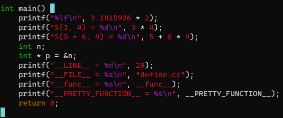
输出
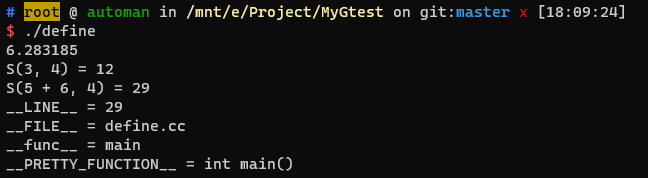

定义LOG宏

```c++
#define LOG(frm, args...) { \
    printf("\033[0;33m[%s : %s : %d] \033[0m", __FILE__, __func__, __LINE__); \
    printf(frm, ##args);\
    printf("\n"); \
};
```
- frm 格式控制字符串;
- args变参数列表部分;
- ...三个点，就是传入多个参数；
- \反斜杠的作用，就是告诉编译器这是一行代码。(宏都是一行代码表示)
- #字符串化，#符号用作一个预处理运算符，它可以把语言符号转化程字符串
- ##宏连接符，宏定义为#define CAT(a, b) a##_##b, CAT(x, y) 就会是x_y

是否开启log宏，可以更改log_flag参数,需要手动修改代码参数，还可以宏定义的覆盖，还可以使用条件编译
```c++
int log_flag = 0;
// 关闭log日志，打印宏
#define LOG(frm, args...) do { \
    if (log_flag == 0) break; \
    printf("\033[0;33m[%s : %s : %d] \033[0m", __FILE__, __func__, __LINE__); \
    printf(frm, ##args);\
    printf("\n"); \
} while(0);

// 宏定义的覆盖
#define LOG(frm, args...) { \
    printf("\033[0;33m[%s : %s : %d] \033[0m", __FILE__, __func__, __LINE__); \
    printf(frm, ##args);\
    printf("\n"); \
};

#undef LOG
#define LOG(frm, args...)


// 条件式编译
#ifdef DEBUG

#define LOG(frm, args...) { \
    printf("\033[0;33m[%s : %s : %d] \033[0m", __FILE__, __func__, __LINE__); \
    printf(frm, ##args);\
    printf("\n"); \
};

#else
#define LOG(frm, args...)

#endif
```

打开日志信息，还可以在编译器选项中，定义宏,无需修改代码
```
g++ -DDEBUG log.cc
```
**决定可执行程序功能的是经过预处理阶段之后那部分代码**

### 7.简单测试框架实现
#### EXPECT系列封装实现
实现如下EXPECT系列
```c++
TEST(test, add1) {
    EXPECT_EQ(add(3, 4), 7); // ==
    EXPECT_NE(add(3, 4), 9); // !=
    EXPECT_LT(add(3, 4), 8); // <
    EXPECT_LE(add(3, 4), 7); // <=
    EXPECT_GT(add(3, 4), 6); // >
    EXPECT_GE(add(3, 4), 7); // >=
}
```
可利用宏定义来实现，代码重复性太高，不够优雅
```c++
#define EXPECT_EQ(a, b) { \
    if (!((a) == (b))) { \
        print("error\n"); \
    } \
}

#define EXPECT_NE(a, b) { \
    if (!((a) != (b))) { \
        print("error\n"); \
    } \
}

#define EXPECT_LT(a, b) { \
    if (!((a) < (b))) { \
        print("error\n"); \
    } \
}

```

好的工程实现，优雅的代码实现
```c++
// typeof 是操作符，typeof(a*b)并不真的计算a*b的值，而是获得计算的结果的类型。
#define EXPECT(a, comp, b) { \
    __typeof(a) __a = (a), __b = (b); \
    if (!((__a) comp (__b))) { \
        printf(YELLOW("  %s:%d: Failure\n"), __FILE__, __LINE__); \
        printf(YELLOW("    Expected: (%s) %s (%s), actual: %d vs %d\n"), \
        #a, #comp, #b, __a, __b); \
    } \
}
#define EXPECT_EQ(a, b) EXPECT(a, ==, b)
#define EXPECT_NE(a, b) EXPECT(a, !=, b)
#define EXPECT_LT(a, b) EXPECT(a, <, b)
#define EXPECT_LE(a, b) EXPECT(a, <=, b)
#define EXPECT_GT(a, b) EXPECT(a, >, b)
#define EXPECT_GE(a, b) EXPECT(a, >=, b)
```
#### COLOR封装实现
同理两组实现颜色显示

冗余的实现，不够优雅
```c++
#define RED(msg) "\033[0;1;31m" msg "\033[0m"
#define GREEN(msg) "\033[0;1;32m" msg "\033[0m"
#define YELLOW(msg) "\033[0;1;33m" msg "\033[0m"
#define BLUE(msg) "\033[0;1;34m" msg "\033[0m"
```

好的工程实现，优雅的实现
```c++

// "hello world" 与 "hello" " " "world" 是同样的字符串
// c++字符串常量的另一种表示方式
#define COLOR(msg, code) "\033[0;1;" #code "m" msg "\033[0m"
#define RED(msg)    COLOR(msg, 31) 
#define GREEN(msg)  COLOR(msg, 32) 
#define YELLOW(msg) COLOR(msg, 33)  
#define BLUE(msg)   COLOR(msg, 34) 
```

#### 使用__attribute__ 完成函数注册功能

**构造函数会先于主函数执行**
```c++
// 不加__attribute__ 这一行，只会输出一行代码
// 加上之后，会把 test 函数转换为构造函数
__attribute__((constructor))
void test() {
    printf("test : hello kaikeba\n");
    return ;
}

int main() {
    printf("main : hello kaiekba\n");
    return 0;
}
```

#### TEST与RUN_ALL_TESTS的实现
```c++
#define TEST(a, b)  \
// 这里要声明一下
void my_##a##_##b(); \
__attribute__((constructor)) \
void reg_##a##_##b() { \
    add_test_func(my_##a##_##b, #a "." #b); \
} \
// 这里紧接着后边是要测试函数的实现
void my_##a##_##b()

struct {
    void (*func)();
    const char *func_name;
} func_arr[100];
int func_cnt = 0;

void add_test_func(void (*func)(), const char *str) {
    func_arr[func_cnt].func = func; // 传入函数地址
    func_arr[func_cnt].func_name = str; // 传入函数名
    func_cnt++;
    return ;
}

int RUN_ALL_TESTS() {
    // 遍历所有的测试用例
    // run every test case
    for (int i = 0; i < func_cnt; i++) {
        printf(GREEN("[  RUN    ]") " %s\n", func_arr[i].func_name);
        func_arr[i].func();
    }
    return 0;
}
```

上班TEST的替换之后的代码，方便理解
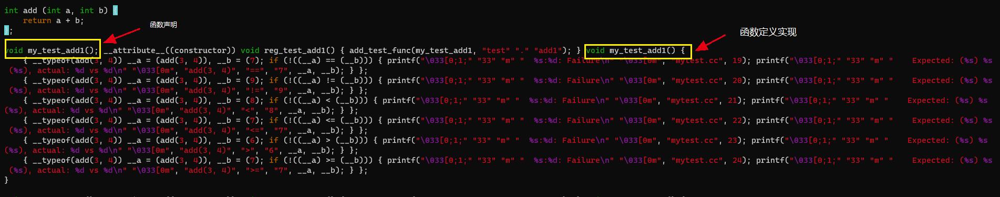

RUN_ALL_TESTS简单的就是先开辟一块内存，存放这些测试函数的地址，主要是通过注册函数，就是把测试函数的地址依次写进这块存储区，具体代码
```c++
__attribute__((constructor)) \
void reg_##a##_##b() { \
    add_test_func(my_##a##_##b, #a "." #b); \
}

void add_test_func(void (*func)(), const char *str) {
    func_arr[func_cnt].func = func; // 传入函数地址
    func_arr[func_cnt].func_name = str; // 传入函数名
    func_cnt++;
    return ;
}
```

最终自己实现的GoogleTest测试框架的输出

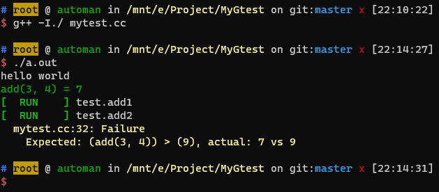
